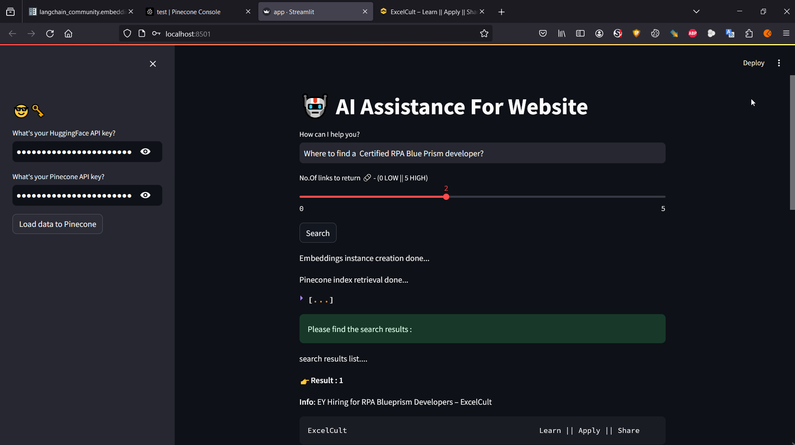

# About
A support chatbot app to ask questions about website data. Uses Pinecone as vectorDB store, and Huggingface's API for embeddings.

## 1. Create venv
``python3 -m venv venv``

## 2. Activate venv
``source venv/bin/activate``
OR
``venv\Scripts\activate``

## 3. Install dependencies
``pip install -r requirements.txt``

## 4. Start app
``streamlit run app.py``

## 5. Add HuggingFace API key + Pinecone API key
- Load Data to Pinecone

## 6. Start asking questions 